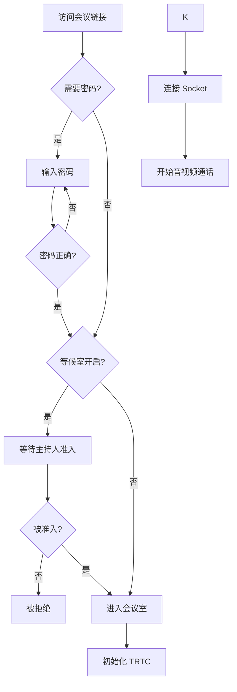
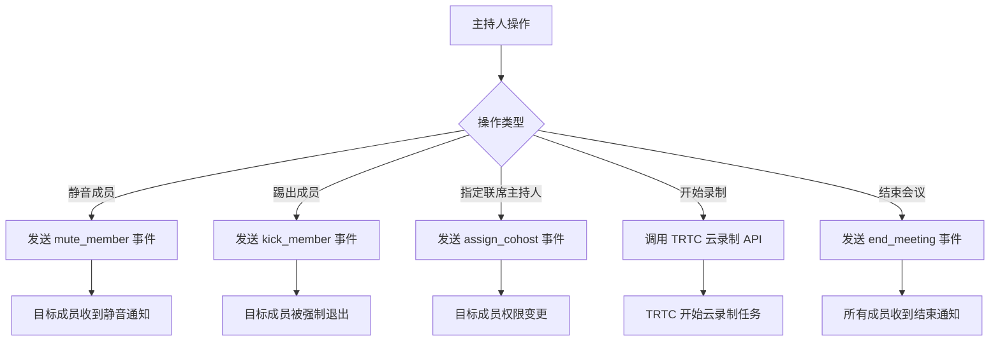
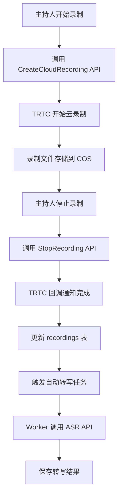

# 会议室页面 (Meeting Room Page) - AI Coding Prompt

> **版本**: v1.0  
> **创建日期**: 2026-01-22  
> **用途**: 为 AI Coding 工具提供会议室页面的产品和架构上下文

---

## 1. 页面概述

**会议室页面** 是智会 (ZhiHui Meeting) 系统的核心功能页面，提供实时音视频通信、屏幕共享、即时通讯、成员管理、会议录制等功能。用户通过该页面参与在线会议。

### 1.1 页面路由
```
/meeting/:meetingId
```

### 1.2 页面参数
| 参数 | 类型 | 说明 |
|------|------|------|
| meetingId | URL Param | 会议唯一标识 (UUID) |
| password | URL Query | 会议密码 (可选) |
| userName | URL Query | 显示名称 (可选) |

---

## 2. 页面功能模块

### 2.1 顶部栏 (TopBar)

| 功能 | 说明 | 组件 |
|------|------|------|
| 会议标题 | 显示当前会议名称 | `TopBar.tsx` |
| 主题切换 | 切换 UI 主题色 (蓝/红/粉/青蓝等) | `ThemeSelector.tsx` |
| 布局选择 | 切换视频布局 (宫格/演讲者/焦点) | `LayoutSelector.tsx` |
| 网络状态 | 显示当前网络质量指示器 | `TopBar.tsx` |
| 录制状态 | 显示录制中状态和时长 | `TopBar.tsx` |

### 2.2 视频区域 (VideoGrid)

| 功能 | 说明 | 组件 |
|------|------|------|
| 本地视频 | 显示当前用户摄像头画面 | `VideoGrid.tsx` |
| 远程视频 | 显示其他参会者视频画面 | `VideoGrid.tsx` |
| 屏幕共享 | 显示共享屏幕内容 | `VideoGrid.tsx` |
| 活跃发言者 | 高亮显示当前发言者 | `VideoGrid.tsx` |
| 静音指示 | 显示每个用户的麦克风状态 | `VideoGrid.tsx` |

**布局模式**:
- `gallery` - 宫格模式：所有参会者平均分配空间
- `speaker` - 演讲者模式：当前发言者放大显示
- `focus` - 焦点模式：仅显示屏幕共享内容

### 2.3 底部工具栏 (Toolbar)

| 功能 | 图标 | 状态 | 权限 |
|------|------|------|------|
| 麦克风 | 🎤 | 开/关/被禁言 | 全员 |
| 摄像头 | 📹 | 开/关/被关闭 | 全员 |
| 屏幕共享 | 🖥️ | 开/关 | 全员 |
| 全屏 | ⛶ | 开/关 | 全员 |
| 成员 | 👥 | 显示人数 | 全员 |
| 举手 | ✋ | 举手/放下 | 普通成员 |
| 录制 | ⏺️ | 录制中/未录制 | 主持人/联席主持人 |
| 邀请 | ➕ | - | 全员 |
| 设置 | ⚙️ | - | 全员 |
| 离开 | 📴 | 离开/结束会议 | 全员 (结束按钮仅主持人) |

### 2.4 成员面板 (MemberPanel)

| 功能 | 权限 | 说明 |
|------|------|------|
| 成员列表 | 全员 | 显示所有在线成员及状态 |
| 搜索成员 | 全员 | 按名称搜索 |
| 静音成员 | 主持人/联席主持人 | 将指定成员静音 |
| 关闭视频 | 主持人/联席主持人 | 关闭指定成员摄像头 |
| 重命名 | 主持人/联席主持人 | 修改成员显示名称 |
| 踢出 | 主持人/联席主持人 | 将成员移出会议 |
| 永久封禁 | 主持人/联席主持人 | 禁止再次加入 |
| 指定联席主持人 | 主持人 | 提升为联席主持人 |
| 转让主持人 | 主持人 | 将主持人身份转让 |
| 全体静音 | 主持人/联席主持人 | 静音所有成员 |
| 锁定会议 | 主持人/联席主持人 | 阻止新成员加入 |


### 2.6 其他模态框

| 组件 | 功能 |
|------|------|
| `PasswordModal` | 输入会议密码 |
| `InviteModal` | 邀请参会者 / 复制会议链接 |
| `SettingsModal` | 选择麦克风/摄像头设备、语言、主题 |
| `EndMeetingModal` | 确认离开/结束会议 |
| `WaitingRoom` | 等候室管理 (准入/拒绝) |

---
## 设计原则
Socket 为唯一状态源：TRTC 检测到的状态变化必须通报到 Socket，由 Socket 统一管理和广播。
Socket 为唯一状态源：TRTC 检测到的状态变化必须通报到 Socket，由 Socket 统一管理和广播。
Socket 为唯一状态源：TRTC 检测到的状态变化必须通报到 Socket，由 Socket 统一管理和广播。


## 3. 角色与权限系统

### 3.1 角色定义

| 角色 | 英文标识 | 说明 | 数量限制 |
|------|----------|------|----------|
| 主持人 | `host` | 会议创建者，拥有最高权限 | 1 人 |
| 联席主持人 | `cohost` | 由主持人指定，协助管理 | 多人 |
| 普通成员 | `member` | 默认参会者角色 | 多人 |

### 3.2 权限矩阵

```
┌──────────────────────────────┬──────┬─────────┬────────┐
│           权限               │ 主持人│联席主持人│ 普通成员│
├──────────────────────────────┼──────┼─────────┼────────┤
│ 控制自己音频/视频             │  ✅  │   ✅    │   ✅   │
│ 屏幕共享                      │  ✅  │   ✅    │   ✅   │
│ 离开会议                      │  ✅  │   ✅    │   ✅   │
│ 举手                          │  ✅  │   ✅    │   ✅   │
├──────────────────────────────┼──────┼─────────┼────────┤
│ 静音/关闭他人视频             │  ✅  │   ✅    │   ❌   │
│ 重命名/踢出成员               │  ✅  │   ✅    │   ❌   │
│ 录制会议                      │  ✅  │   ✅    │   ❌   │
│ 锁定会议                      │  ✅  │   ✅    │   ❌   │
│ 全体静音                      │  ✅  │   ✅    │   ❌   │
│ 管理等候室                    │  ✅  │   ✅    │   ❌   │
│ 指定联席主持人                │  ✅  │   ✅    │   ❌   │
├──────────────────────────────┼──────┼─────────┼────────┤
│ 转让主持人                    │  ✅  │   ❌    │   ❌   │
│ 移除联席主持人                │  ✅  │   ❌    │   ❌   │
│ 结束会议                      │  ✅  │   ❌    │   ❌   │
└──────────────────────────────┴──────┴─────────┴────────┘
```

---

## 4. 技术架构

### 4.1 技术栈

| 类型 | 技术 | 版本 |
|------|------|------|
| 前端框架 | React + TypeScript | React 19 |
| 构建工具 | Vite | 7.x |
| 路由 | React Router | 7.x |
| 状态管理 | Zustand | 5.x |
| 国际化 | i18next | 25.x |
| 音视频 | 腾讯 TRTC Web SDK | 5.10+ |
| 实时通信 | Socket.io | 4.x |
| 后端框架 | Express.js | 5.x |
| 数据库 | SQLite (better-sqlite3) | - |
| 对象存储 | 腾讯云 COS | - |
| 语音转写 | 腾讯云 ASR | - |

### 4.2 前端架构

```
src/
├── pages/
│   ├── Meeting.tsx          # 会议室主页面 (889 行)
│   └── PreJoin.tsx          # 预加入页面 (设备检测)
├── components/meeting/
│   ├── Toolbar.tsx          # 底部工具栏 (432 行)
│   ├── VideoGrid.tsx        # 视频宫格 (191 行)
│   ├── MemberPanel.tsx      # 成员面板 (22KB)
│   ├── TopBar.tsx           # 顶部栏
│   ├── FloatingPanel.tsx    # 浮动面板容器
│   ├── ThemeSelector.tsx    # 主题选择器
│   ├── LayoutSelector.tsx   # 布局选择器
│   ├── SettingsModal.tsx    # 设置模态框
│   ├── InviteModal.tsx      # 邀请模态框
│   ├── EndMeetingModal.tsx  # 结束会议模态框
│   ├── PasswordModal.tsx    # 密码输入模态框
│   ├── WaitingRoom.tsx      # 等候室面板
│   ├── RecordingControl.tsx # 录制控制
│   └── LanguageSelector.tsx # 语言选择器
├── services/
│   ├── trtc.ts              # TRTC 服务封装 (374 行)
│   ├── socket.ts            # Socket.io 服务 (546 行)
│   ├── meetingApi.ts        # 会议 API
│   └── store.ts             # Zustand 状态存储
├── hooks/
│   ├── useTRTC.ts           # TRTC Hook
│   ├── useSocket.ts         # Socket Hook
│   ├── useRecording.ts      # 录制 Hook
│   ├── useRoomState.ts      # 房间状态 Hook
│   ├── useMeetingRoom.ts    # 会议室 Hook
│   ├── useMeetingHandlers.ts # 会议事件处理 Hook
│   ├── usePermissions.ts    # 权限 Hook
│   └── useRemoteVideo.ts    # 远程视频 Hook
└── types/
    └── index.ts             # TypeScript 类型定义
```

### 4.3 后端架构

```
server/src/
├── index.ts                 # 服务入口 (Express + Socket.io)
├── db/
│   └── index.ts             # 数据库初始化 (508 行)
├── routes/
│   ├── meetings.ts          # 会议 CRUD API (29KB)
│   ├── recording.ts         # 录制管理 API (35KB)
│   ├── transcription.ts     # 转写 API (21KB)
│   ├── users.ts             # 用户 API
│   ├── usersig.ts           # UserSig 生成 API
│   └── storage.ts           # COS 存储 API
├── services/
│   └── ...                  # 业务逻辑服务
├── socket/
│   └── index.ts             # Socket.io 事件处理
└── utils/
    └── ...                  # 工具函数
```

---

## 5. 数据结构

### 5.1 核心数据表

#### meetings (会议表)
```sql
CREATE TABLE meetings (
    id TEXT PRIMARY KEY,
    title TEXT NOT NULL,
    password TEXT,
    created_by TEXT NOT NULL,
    host_id TEXT NOT NULL,
    status TEXT CHECK(status IN ('waiting', 'scheduled', 'ongoing', 'ended')),
    started_at INTEGER,
    ended_at INTEGER,
    scheduled_at INTEGER,
    duration INTEGER DEFAULT 30,
    repeat_frequency TEXT DEFAULT 'none',
    created_at INTEGER,
    updated_at INTEGER
);
```

#### meeting_members (会议成员表)
```sql
CREATE TABLE meeting_members (
    id INTEGER PRIMARY KEY AUTOINCREMENT,
    meeting_id TEXT NOT NULL,
    user_id TEXT NOT NULL,
    user_name TEXT NOT NULL,
    role TEXT CHECK(role IN ('host', 'cohost', 'member')),
    is_muted INTEGER DEFAULT 0,
    is_camera_off INTEGER DEFAULT 0,
    joined_at INTEGER,
    left_at INTEGER,
    FOREIGN KEY (meeting_id) REFERENCES meetings(id)
);
```

#### recordings (录制记录表)
```sql
CREATE TABLE recordings (
    id TEXT PRIMARY KEY,
    meeting_id TEXT NOT NULL,
    started_by TEXT NOT NULL,
    user_id TEXT,              -- 单流录制时对应用户
    record_mode TEXT CHECK(record_mode IN ('mixed', 'single')),
    task_id TEXT,              -- TRTC 录制任务 ID
    cos_file_key TEXT,
    file_url TEXT,
    status TEXT CHECK(status IN ('recording', 'completed', 'failed')),
    started_at INTEGER,
    ended_at INTEGER,
    duration INTEGER,
    FOREIGN KEY (meeting_id) REFERENCES meetings(id)
);
```


### 5.2 前端核心类型

```typescript
// 成员状态
interface MemberState {
    userId: string;
    userName: string;
    role: 'host' | 'cohost' | 'member';
    isAudioOn: boolean;
    isVideoOn: boolean;
    isScreenSharing: boolean;
    isHandRaised: boolean;
}

// 房间状态
interface RoomState {
    meetingId: string;
    hostId: string;
    isLocked: boolean;
    isAllMuted: boolean;
    allowSelfUnmute: boolean;
    recording: {
        isRecording: boolean;
        taskId?: string;
        startedBy?: string;
    };
    members: MemberState[];
}

// TRTC 配置
interface TRTCConfig {
    sdkAppId: number;
    userId: string;
    userSig: string;
    roomId: number;
}

// 视频布局类型
type LayoutType = 'gallery' | 'speaker' | 'focus';
```

---

## 6. 用户流程

### 6.1 加入会议流程



### 6.2 主持人管理流程



### 6.3 录制与转写流程



---

## 7. 实时通信

### 7.1 TRTC 事件

| 事件 | 说明 |
|------|------|
| `onRemoteUserEnter` | 远程用户进入房间 |
| `onRemoteUserLeave` | 远程用户离开房间 |
| `onRemoteVideoAvailable` | 远程用户开启视频 |
| `onRemoteVideoUnavailable` | 远程用户关闭视频 |
| `onRemoteAudioAvailable` | 远程用户开启音频 |
| `onRemoteAudioUnavailable` | 远程用户关闭音频 |
| `onNetworkQuality` | 网络质量变化 |
| `onKickedOut` | 被踢出房间 |

### 7.2 Socket.io 事件

| 事件 | 方向 | 说明 |
|------|------|------|
| `join_room` | Client → Server | 加入会议室 |
| `leave_room` | Client → Server | 离开会议室 |
| `room_state` | Server → Client | 房间状态同步 |
| `member_joined` | Server → Client | 新成员加入 |
| `member_left` | Server → Client | 成员离开 |
| `member_state_changed` | Server → Client | 成员状态变化 |
| `audio_state` | Client → Server | 广播音频状态 |
| `video_state` | Client → Server | 广播视频状态 |
| `mute_member` | Client → Server | 静音成员 |
| `kick_member` | Client → Server | 踢出成员 |
| `muted_by_host` | Server → Client | 被主持人静音 |
| `kicked` | Server → Client | 被踢出通知 |
| `meeting_ended` | Server → Client | 会议结束通知 |
| `start_recording` | Client → Server | 开始录制 |
| `stop_recording` | Client → Server | 停止录制 |
| `recording_started` | Server → Client | 录制已开始 |
| `recording_stopped` | Server → Client | 录制已停止 |


## 8. API 接口

### 8.1 会议相关 API

```http
# 获取会议详情
GET /api/meetings/:meetingId

# 加入会议
POST /api/meetings/:meetingId/join
Body: { userId, userName, password? }

# 离开会议
POST /api/meetings/:meetingId/leave
Body: { userId }

# 结束会议
POST /api/meetings/:meetingId/end
Body: { userId }

# 获取 UserSig
POST /api/usersig
Body: { userId }
```

### 8.2 录制相关 API

```http
# 开始录制
POST /api/recording/start
Body: { meetingId, userId, roomId }

# 停止录制
POST /api/recording/stop
Body: { meetingId, taskId }

# 录制回调 (TRTC)
POST /api/recording/callback
Body: { EventType, Payload }

# 获取录制列表
GET /api/recordings?meetingId=xxx
```

---

## 9. 设计规范

### 9.1 FanDesign 设计系统

```json
{
  "colors": {
    "primary": "#07C160",
    "success": "#07C160",
    "warn": "#FFBE00",
    "error": "#FA5151",
    "link": "#576B95",
    "background": {
      "page": { "light": "#F2F2F2", "dark": "#111111" },
      "cell": { "light": "#FFFFFF", "dark": "#191919" }
    }
  },
  "spacing": {
    "page_edge": 16,
    "element_gap": 8
  },
  "borderRadius": {
    "button": 8,
    "card": 12
  }
}
```

### 9.2 响应式断点

| 设备 | 宽度范围 |
|------|----------|
| 移动端 | < 768px |
| 平板端 | 768px - 1024px |
| 桌面端 | > 1024px |

### 9.3 国际化

- 支持语言：简体中文 (zh-CN)、英文 (en)
- i18n 文件位置：`src/i18n/locales/`
- 所有用户可见文本必须使用 `t()` 函数

---

## 10. 开发指南

### 10.1 环境变量

```env
# TRTC 配置
VITE_TRTC_SDK_APP_ID=20032332

# API 地址
VITE_API_URL=http://localhost:3001

# 后端配置
TRTC_SECRET_KEY=xxx
COS_SECRET_ID=xxx
COS_SECRET_KEY=xxx
```

### 10.2 启动命令

```bash
# 前端开发
npm run dev

# 后端开发
cd server && npm run dev

# Worker 开发
cd worker && npm run dev
```

### 10.3 测试

```bash
# 运行前端测试
npm run test

# 运行后端测试
cd server && npm run test
```

---

## 11. 常见扩展需求

### 11.1 新增工具栏按钮

1. 在 `Toolbar.tsx` 中添加图标组件
2. 在 `ToolbarProps` 接口中添加相关 props
3. 在 `Meeting.tsx` 中实现回调函数
4. 添加国际化文本

### 11.2 新增成员管理功能

1. 在 `socket.ts` 的 `SocketService` 中添加方法
2. 在后端 `socket/index.ts` 中添加事件处理
3. 在 `MemberPanel.tsx` 中添加 UI
4. 更新权限矩阵

### 11.3 新增视频布局

1. 在 `LayoutSelector.tsx` 中添加布局选项
2. 在 `VideoGrid.tsx` 的 `getGridClass()` 中添加布局逻辑
3. 更新 CSS 样式


---

## 12. 注意事项

1. **TRTC 单例**: `TRTCService` 是单例模式，整个应用只有一个实例
2. **房间号类型**: TRTC 房间号为数字类型，会议 ID 为 UUID
3. **权限检查**: 所有管理操作需在前后端双重校验权限
4. **并发处理**: Socket.io 事件需考虑网络延迟和消息顺序
5. **资源释放**: 离开会议时需正确释放 TRTC、IM、Socket 资源
6. **设备权限**: 首次使用需用户授权摄像头和麦克风
7. **浏览器兼容**: 需支持 Chrome 90+、Safari 14+、Firefox 88+

---

## 13. 相关文档

- [腾讯 TRTC Web SDK](https://trtc.io/zh/document/59649?platform=web)
- [TRTC 云录制 API](https://cloud.tencent.com/document/product/647/73786)
- [项目 PRD](./prd.md)
- [项目蓝图](./blueprint.md)
